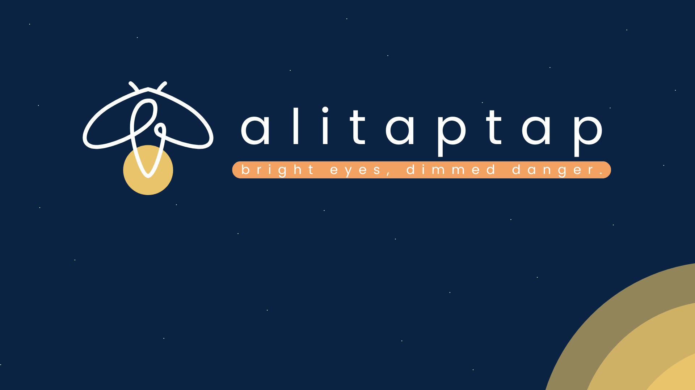

Alitaptap is an AI-powered fire safety inspector for household photos. By using GenAI computer vision, our web application allows anyone to snap a photo of a room and instantly receive a quantifiable "Flammability Score." The system acts as a pocket fire inspector, identifying spatial hazards and providing an actionable, step-by-step checklist to resolve risks and generate compliance reports.
> We’ve become blind to the clutter that fuels these disasters.*
# 📖 The Problem & Vision
The Fire Crisis: In just the first four months of 2026, the Philippines has faced a fire crisis. From January 1 to May 1, 2026, fire incidents nationwide surged to 8,068 cases—a staggering 36% jump compared to last year. With fire damage in Metro Manila alone rising by 34% this year, we cannot afford to wait for the sirens.

The Hidden Hazards: According to the Bureau of Fire Protection (BFP), structural fires rose significantly by 29.20%. While we often feel safe at home, human negligence and unattended hazards are the primary drivers of this increase. Household fire hazards are often hidden in plain sight, created by the spatial relationship between everyday objects rather than the objects themselves.

# 💡 Our Solution
The average person understands basic fire safety but lacks the spatial awareness to identify compounding risks (like overloaded power strips hidden under flammable clutter). Hiring a professional fire inspector is an expensive, high-friction process. Alitaptap democratizes home safety, turning your smartphone into a digital fire inspector.

# 🏗️ The 4 Pillars of Alitaptap
Our app scans your room for the top causes of structural fires:
- Stuff: Combustible waste and clutter.
- Power: Electrical faults and overloaded outlets.
- Space: Open flames, cooking hazards, and inadequate clearance around heat sources.
- Path (Exit): Blocked doors and windows—addressing a major BFP concern where storage boxes or equipment chain emergency exits shut.

# ✨ Features
- Instant Analysis: Upload or capture a photo for immediate fire risk assessment.

- AI-Powered: Utilizes the Gemini API for advanced computer vision and contextual awareness.

- Comprehensive Scoring: Four-pillar scoring system (Stuff, Power, Space, Path).

- Actionable Insights: Provides a risk summary, hazard breakdown, and a clear, step-by-step remediation checklist.

- Digital Certification: View a safety certificate upon completion of your audit.

- Accessible Design: PWA-ready frontend with a smooth, mobile-friendly layout, loading states, and an intuitive dashboard.

- Developer Friendly: Full Docker support for both development and production environments.

# 🛠️ Tech Stack
Frontend: React, Vite, React Router, CSS Modules

Backend: FastAPI, Gunicorn, Uvicorn, Python, Pillow, Google Gen AI (Gemini)

Deployment: Docker, Docker Compose, Nginx (for frontend serving)

# 📁 Project Structure
```
├── backend/                  # FastAPI app and Gemini integration
├── frontend/                 # React app and UI components
├── docker-compose.yml        # Production-style container setup
└── docker-compose.dev.yml    # Development container setup with live reload
```
# 🚀 Getting Started
Requirements
Node.js: v20 or newer

Python: v3.11 or newer

Docker & Docker Compose: (If running with containers)

API Key: Google Gemini API key for backend access

Environment Variables
Backend (backend/.env):

GEMINI_API_KEY: Your Gemini API key (Required)

ENVIRONMENT: Optional, typically set to production in prod.

Frontend (frontend/.env):

VITE_API_URL: Backend URL used by the frontend

VITE_ENABLE_DASHBOARD_BYPASS: Optional testing bypass for the dashboard

VITE_PROXY_TARGET: Used by the Vite dev proxy in containerized development

# 💻 Local Development
1. Backend Setup
    Open a terminal and navigate to the backend directory:

    Bash
    cd backend
    python -m venv .venv
```
Activate virtual environment
On Windows: .venv\Scripts\activate
On macOS/Linux: source .venv/bin/activate
```
    pip install -r requirements.txt
    uvicorn main:app --reload --host 0.0.0.0 --port 8000
    API Base URL: http://localhost:8000

    Health Check: http://localhost:8000/api/health

2. Frontend Setup
    Open a new terminal and navigate to the frontend directory:
    
    Bash
    cd frontend
    npm install
    npm run dev
    App URL: http://localhost:5173

Note: By default, the frontend expects the backend at http://localhost:8003 unless VITE_API_URL is set.

# 🐳 Docker Deployment
Development Mode (with Hot Reload)
Run the development compose file:

Bash
docker compose -f docker-compose.dev.yml up --build
Frontend exposed on: http://localhost:3003

Backend exposed on: http://localhost:8003

Production Mode
Run the main compose file for a production-ready stack (FastAPI backend + Nginx frontend):

Bash
docker compose up --build
📡 API Overview
GET /api/health

Returns the backend's current health status.

POST /api/assess

Accepts: multipart/form-data containing a file (uploaded image).

Returns JSON: Contains overall_score, classification, pillars, assessments, agent_note, and remarks.


> "Let’s use Alitaptap to clear the clutter and quench the risk. For every Filipino home, for every 'Alab' in our hearts—let's make safety a routine."

### 💻 Boolean Gaesody
*Bright Eyes, Dimmed Danger* 🌟

- [@paulo10011](https://github.com/paulo10011) 
- [@Neil-023](https://github.com/Neil-023)   
- [@alhtb](https://github.com/alhtb) 
